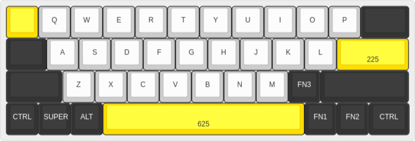

# Just 40

A 40% keyboard project, with just 40 keys.

Started the project after just one year of having started using mechanical keyboards. 

Just a month or two after the first Keychron K8 Pro ISO, I swithced to a 
Keychron K1 Pro ANSI (low profile). The K8 was nice and the K1 much nicer.

Less then a month before starting this project, I switched to the 60% K9 Pro - even better: 
I love being able to reach more keys/controls moving my palms less! 

Changed the switches to Gateron banana, added o-rings
and by then I relized I was already too deep into the rabbit hole... concerning how little it took!

#### Why 40%?

Ergonomics!

I want to move my hands even less than I do with the 60%

#### Why staggered vs ortholinear split?

I mulled for long about it, but I feel staggered being ergonomic just right.

My hands and wrists are correctly angled, the same as they would be on a split,
and in that position the staggered keys turn out to be vertical relative to my fingers...
honestly I can't understand why I never read this from anybody else.

Last, as a musician, I really don't mind [twisting](https://en.wikipedia.org/wiki/Twister_(game))
my fingers for some keyboard shortct combination,
so long as I can keep my elbows and wrists relaxed.

#### Alternatives / Inspirations
I've searched for qute some time for 40% offerings, the most interesting to me
 - [Vortex Core Plus](https://vortexgear.store/products/core-plus)
 - [Litl keyboard](https://sthlmkb.com/shop/litl-keyboard-kit/)
 - [Skelett 40](https://novelkeys.com/collections/keyboards/products/skelett-40-keyboard-kit)

All three are very nice but none has RGB (not sure about the Core),
the Core has too many keys (well, not really, but then why leave my nice 60%?),
and both Litl and Skelett have some key not where I wish they were...

I really liked the Litl look with the electronics exposed, 
I'll surely take inspiration as much as from several ortholinear split seen around.
No rotary though, I'll likely add LEDs for battery, `Caps`, `Nums`, 
Bluetooth (I want 3), etc., with the same info from the LEDs in an OLED with extra details (and a typing cat).

[KLEs](kle/README.md)

## Hardware

I considered handwiring and I know I would have loved it, but wanting RGB
and as low a possible profile, it seemed prohivitive.

RGB because I'm a kid at heart (but no animations). I've been wanting to try customizing QKM
to get per-key colours, particularly on layers.

While I'm there I'll use [hot-swap sockets](#hot-swap-sockets).

### LEDs

[NeoPixel Reverse Mount RGB LEDs](https://www.digikey.co.uk/en/products/detail/adafruit-industries-llc/4960/14302512)

### Switches

Low profile for the ergonomics. Really considered hard to use standard MX,
mostly for the stabilizers since I can't say I like the low profile's, but MXLPs will be.

[Gateron KS-33 Low Profile 2.0 Banana Switch](https://www.gateron.com/products/gateron-ks-33-low-profile-20-banana-switch?VariantsId=10734)

Will be mounted south-facing ([somebody did it](https://www.xda-developers.com/what-i-want-in-my-dream-keyboard/#:~:text=South%2Dfacing%20customizable%20LEDs).)

### Stabilizers

See comments in the [switches section](#switches)

[Gateron Low Profile Plate Mounted Stabilizer](https://www.gateron.com/products/gateron-low-profile-plate-mounted-stabilizer?VariantsId=10477)

### Hot-swap sockets

[Gateron Low Profile Switch Hot-swap PCB 2.0 Socket](https://www.gateron.com/products/gateron-low-profile-switch-hot-swap-pcb-socket?VariantsId=10234)

### Microcontroller

Undecided, some option, all with (required) Bluetooth 

[Pimoroni Pico Plus 2 W](https://shop.pimoroni.com/products/pimoroni-pico-plus-2-w?variant=42182811942995) - not-original Rasperry

[Raspberry Pi Pico 2 W](https://www.raspberrypi.com/products/raspberry-pi-pico-2/) - not USB-C

[STMicroelectronics STM32F411 BlackPill](https://www.st.com/en/microcontrollers-microprocessors/stm32f411.html) - expensive?

## KiCad

### 3rd party libraries

[MX_V2](https://github.com/ai03-2725/MX_V2)

## Firmware

