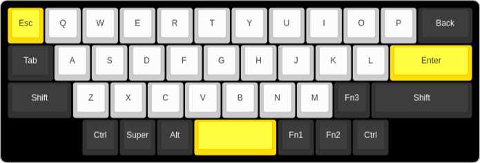

# Just 40

A 40% keyboard project, with just 40 keys.

Started the project after just one year of having started using mechanical keyboards. 

Just a month or two after the first Keychron K8 Pro ISO, I swithced to a 
Keychron K1 Pro ANSI (low profile). The K8 was nice and the K1 much nicer.

Less then a month before starting theis repo I switched to the 60% K9 Pro - even better.

Changed the switches to Gateron banana, added o-rings... and by then I relized I was already too deep into the rabbit hole!

I've searched for qute some time for 40% offerings, the most interesting to me
 - [Vortex Core Plus](https://vortexgear.store/products/core-plus)
 - [Litl keyboard](https://sthlmkb.com/shop/litl-keyboard-kit/)
 - [Skelett 40](https://novelkeys.com/collections/keyboards/products/skelett-40-keyboard-kit)

All three are very nice but non has RGB (not sure about the Core),
the Core has too many keys (well, not really, but then why leave my nice 60%?),
and both Litl and Skelett have sone key not where I wish they were...

## Specs

## KLEs

[Keyboard-Layout-Editor](https://www.keyboard-layout-editor.com/#/) configurations.

Both layouts use the same keys for the same columns, just different key sizes.

Traditional uses the standard spacebar remaining as close as possible to standard
60%, 80%, and 100%.
The [HHKB](https://www.keyboard-layout-editor.com/#/) style will perhaps be more ergonomic,
but moving further away from standards.

#### Traditional

#### HHBK

