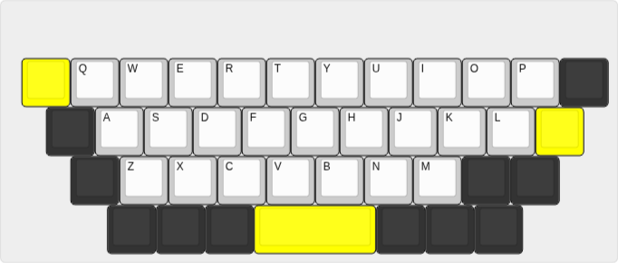
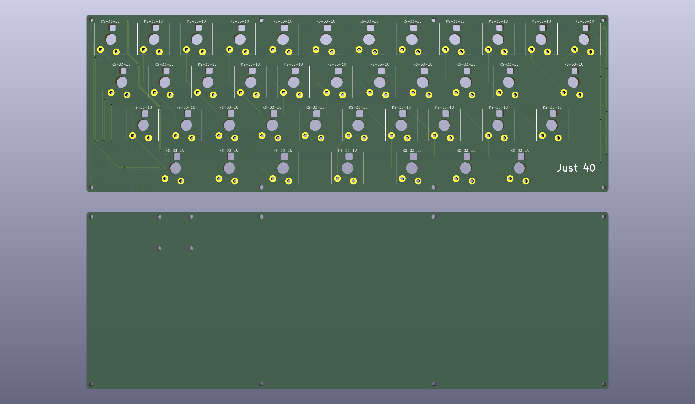
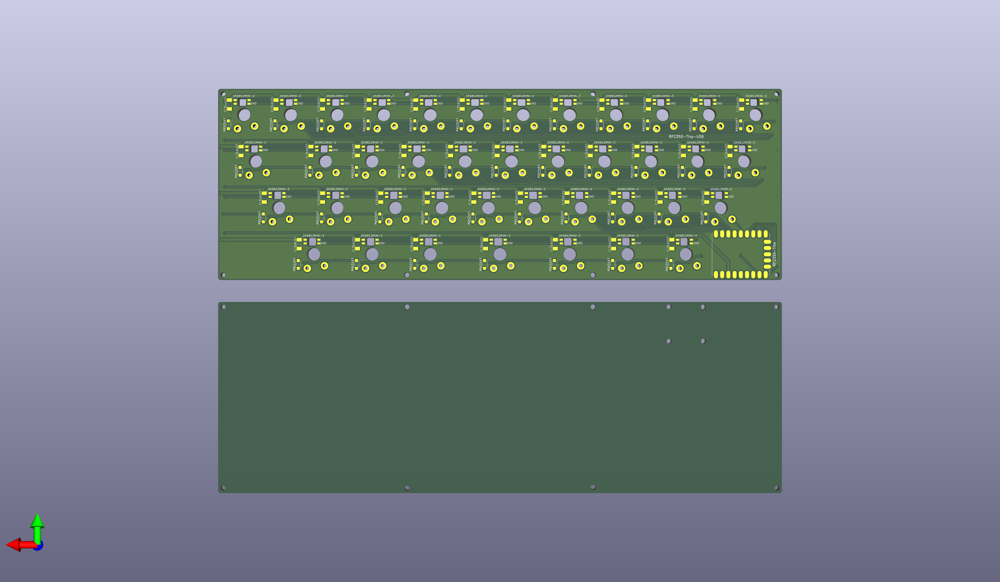

# Just 40

A 40% keyboard project, just 40 keys.

Staggered layout

Black unmarked [YMDK ultra slim low profile](https://ymdkey.com/search?q=Ultra-slim+Low+profile) for the control keys

[XVX Skyline R2](https://www.xvxchannel.com/en-gb/collections/low-profile-keycaps/products/xvx-skyline-r2) for alphas (which I like more for feel and sound)

[Waveshare RP2350-Tiny Development Board](https://www.waveshare.com/wiki/RP2350-Tiny)

[NeoPixel Reverse Mount RGB LEDs](https://www.digikey.co.uk/en/products/detail/adafruit-industries-llc/4960/14302512)

[Gateron KS-33 Low Profile 2.0 Banana Switch](https://www.gateron.com/products/gateron-ks-33-low-profile-20-banana-switch?VariantsId=10734)
soldered for plateless mount

PCB developed with KiCAD

Front

Back

#### Alternatives / Inspirations
I've searched for quite some time for 40% offerings, the most interesting to me
 - [Vortex Core Plus](https://vortexgear.store/products/core-plus)
 - [Litl keyboard](https://sthlmkb.com/shop/litl-keyboard-kit/)
 - [Skelett 40](https://novelkeys.com/collections/keyboards/products/skelett-40-keyboard-kit)

## coming soon

Micropython code 

