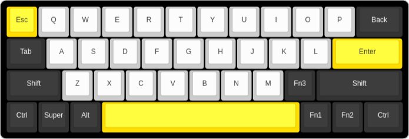

# Just 40

40% keyboard project, with just 40 keys.

## KLEs

[Keyboard-Layout-Editor](https://www.keyboard-layout-editor.com/#/) configurations.

Both layouts use the same keys for the same columns, just different key sizes.

Traditional uses the standard keys as most 60%, 80%, and 100%, 
[HHKB](https://www.keyboard-layout-editor.com/#/) style will perhaps be more ergonomic.

#### Traditional

#### HHBK

